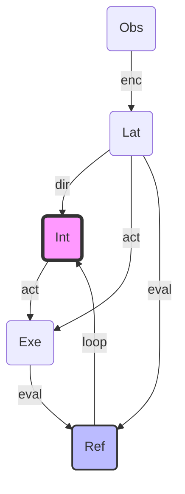

"""
AI Math & Logic: Strange Loop Formalization

This document formalizes the Recursive Intent mechanism using Category Theory.
It maps the Douglas Hofstadter "Strange Loop" concepts into a mathematical
structure of Objects and Morphisms.

CFG Structure:
═══════════════════════════════════════════════════════════════════════════════
Start Symbol : AIMathLogic (this document)

Non-Terminals :
┌─ INTERNAL (Category Components) ──────────────────────────────────────────┐
│ <Objects> → Definitions of system states │
│ <Morphisms> → Transformations between states │
│ <Composition> → The recursive loop structure │
└───────────────────────────────────────────────────────────────────────────┘

┌─ EXTERNAL (Theoretical Context) ──────────────────────────────────────────┐
│ <CategoryC> ← The category of Antigravity States │
│ <GEB_Logic> ← Strategic principles from GEB │
└───────────────────────────────────────────────────────────────────────────┘

Terminals : Identity, Functor, Natural Transformation, Fixed Point

Production Rules:
AIMathLogic → <Objects> + <Morphisms> + <Composition>
═══════════════════════════════════════════════════════════════════════════════
"""

# Strange Loop: A Category Theoretic Perspective

Dalam implementatif **Antigravity V2**, kita mendefinisikan sistem sebagai kategori $\mathcal{A}$ (Antigravity). Kategori ini bukan sekadar aliran data linear, melainkan struktur yang memungkinkan referensi diri.

## 1. Objects (Obj)

Objek dalam kategori $\mathcal{A}$ mewakili ruang representasi informasi pada berbagai tingkatan (_Levels of Description_):

- **$Obs$ (Observation Space)**: Ruang spike/event mentah dari `v2e`.
- **$Lat$ (Latent Space)**: Ruang representasi temporal-visual dari `V-JEPA`.
- **$Int$ (Intent Space)**: Ruang semantik/label dari `VL-JEPA` (Director).
- **$Exe$ (Execution Space)**: Ruang hasil perhitungan dan bounding box dari `CountGD`.
- **$Ref$ (Reflection Space)**: Ruang metadata anomali dan tingkat kepercayaan (Surprise).

## 2. Morphisms (Arrows)

Morphism mewakili transformasi informasi antar objek:

- **$enc: Obs \to Lat$**: Transformasi "persepsi" (v2e ke V-JEPA).
- **$dir: Lat \to Int$**: Transformasi "direksi" (V-JEPA ke VL-JEPA).
- **$act: Int \times Lat \to Exe$**: Transformasi "aksi" (Instruksi + Konteks ke Perhitungan).
- **$eval: Exe \times Lat \to Ref$**: Transformasi "evaluasi" (Hasil vs Realitas).
- **$loop: Ref \times Int \to Int$**: Morphism krusial yang mendefinisikan **Recursive Intent**.

## 3. Composition & Strange Loop

Operasi inti dari Strange Loop kita adalah komposisi yang menghasilkan referensi diri:

$$f_{loop} = loop \circ eval \circ act$$

Secara visual, ini membentuk siklus:

### Isomorphism & Isomorphism Failure

- **Isomorphism**: Kita mengharapkan morphism $act$ menghasilkan hasil yang isomorfik (konsisten) dengan realitas objektif yang diprediksi di $Lat$.
- **Strange Loop Trigger**: Ketika $eval$ mendeteksi kegagalan isomorfisme (anomali), morphism $loop$ diaktifkan untuk melakukan pemetaan ulang pada objek $Int$ (Intent).

## 4. Fixed Point (Titik Kesetimbangan)

Dalam Category Theory, kesadaran fungsional sistem tercapai ketika $Int$ mencapai **Fixed Point** melalui rekursi berkali-kali:
$$Int_{n+1} = f_{loop}(Int_n)$$
Sistem berhenti melakukan "refleksi" ketika representasi internalnya ($Int$) sudah sepenuhnya isomorfik dengan realitas $Lat$.
