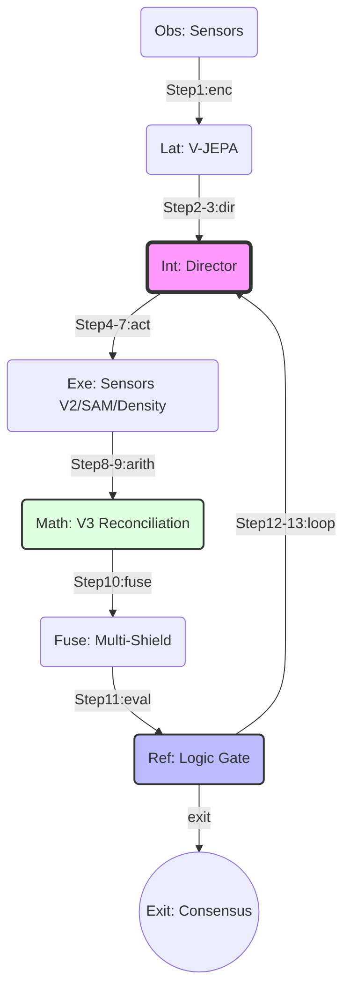

"""
AI Math & Logic: Strange Loop Formalization

This document formalizes the Recursive Intent mechanism using Category Theory.
It maps the Douglas Hofstadter "Strange Loop" concepts into a mathematical
structure of Objects and Morphisms.

CFG Structure:
═══════════════════════════════════════════════════════════════════════════════
Start Symbol : AIMathLogic (this document)

Non-Terminals :
┌─ INTERNAL (Category Components) ──────────────────────────────────────────┐
│ <Objects> → Definitions of system states │
│ <Morphisms> → Transformations between states │
│ <Composition> → The recursive loop structure │
└───────────────────────────────────────────────────────────────────────────┘

┌─ EXTERNAL (Theoretical Context) ──────────────────────────────────────────┐
│ <CategoryC> ← The category of Antigravity States │
│ <GEB_Logic> ← Strategic principles from GEB │
└───────────────────────────────────────────────────────────────────────────┘

Terminals : Identity, Functor, Natural Transformation, Fixed Point

Production Rules:
AIMathLogic → <Objects> + <Morphisms> + <Composition>
═══════════════════════════════════════════════════════════════════════════════
"""

# Strange Loop: A Category Theoretic Perspective

Dalam implementatif **Antigravity V2**, kita mendefinisikan sistem sebagai kategori $\mathcal{A}$ (Antigravity). Kategori ini bukan sekadar aliran data linear, melainkan struktur yang memungkinkan referensi diri.

## 1. Objects (Obj)

Objek dalam kategori $\mathcal{A}$ mewakili ruang representasi informasi pada berbagai tingkatan (_Levels of Description_):

- **$Obs$ (Observation Space)**: Ruang spike/event mentah dari `v2e`.
- **$Lat$ (Latent Space)**: Ruang representasi temporal-visual dari `V-JEPA`.
- **$Int$ (Intent Space)**: Ruang semantik/label dari `VL-JEPA` (Director).
- **$Exe$ (Execution Space)**: Ruang hasil perhitungan dan bounding box dari `CountVid`.
- **$Ref$ (Reflection Space)**: Ruang metadata anomali dan tingkat kepercayaan (Surprise).

## 2. Morphisms (Arrows)

Morphism mewakili transformasi informasi antar objek:

- **$enc: Obs \to Lat$**: Transformasi "persepsi" (v2e ke V-JEPA).
- **$dir: Lat \to Int$**: Transformasi "direksi" (V-JEPA ke VL-JEPA).
- **$act: Int \times Lat \to Exe$**: Transformasi "aksi" (Instruksi + Konteks ke Perhitungan).
- **$eval: Exe \times Lat \to Ref$**: Transformasi "evaluasi" (Hasil vs Realitas).
- **$loop: Ref \times Int \to Int$**: Morphism krusial yang mendefinisikan **Recursive Intent**.

## 3. Composition & Strange Loop

Operasi inti dari Strange Loop kita adalah komposisi yang menghasilkan referensi diri:

$$f_{loop} = loop \circ eval \circ act$$

Secara visual, ini membentuk siklus **Sovereignty Chain** (13-Step Protocol):

```mermaid
graph TD
    Obs(Obs: Sensors) -- Step1:enc --> Lat(Lat: V-JEPA)
    Lat -- Step2-3:dir --> Int(Int: Director)
    Int -- Step4-7:act --> Exe(Exe: Sensors V2/SAM/Density)
    Exe -- Step8-9:arith --> Math(Math: V3 Reconciliation)
    Math -- Step10:fuse --> Fuse(Fuse: Multi-Shield)
    Fuse -- Step11:eval --> Ref(Ref: Logic Gate)
    Ref -- Step12-13:loop --> Int
    Ref -- exit --> Result((Exit: Consensus))

    style Int fill:#f9f,stroke:#333,stroke-width:4px
    style Ref fill:#bbf,stroke:#333,stroke-width:2px
    style Math fill:#dfd,stroke:#333,stroke-width:2px
```

### Isomorphism & Isomorphism Failure

- **Isomorphism**: Kita mengharapkan morphism $act$ menghasilkan hasil yang isomorfik (konsisten) dengan realitas objektif yang diprediksi di $Lat$.
- **Strange Loop Trigger**: Ketika $eval$ mendeteksi kegagalan isomorfisme (anomali), morphism $loop$ diaktifkan untuk melakukan pemetaan ulang pada objek $Int$ (Intent).

## 4. 3D Volumetric Estimation (The "Evidence")

Morphism $eval$ diperkuat dengan pendekatan **Point Cloud Back-projection** melalui `MathUtils`:

### 4.1. Point Cloud Projection Formula

Setiap pixel $(u, v)$ dengan kedalaman $z = Depth(u,v)$ diproyeksikan ke ruang 3D $(x, y, z)$:
$$x = (u - c_x) \times z / f_x$$
$$y = (v - c_y) \times z / f_y$$
Dimana $(c_x, c_y)$ adalah _principal point_ dan $(f_x, f_y)$ adalah _focal length_.

### 4.2. Lattice Counting & Riemann Sums (V-Core)

Volume total $V_{total}$ dihitung dengan menjumlahkan estimasi volume dari setiap cluster volumetrik yang terdeteksi melalui **Fuzzy Semantic Reconciliation**:
$$V_{total} = \sum_{c \in Clusters} MathUtils.estimate\_volume\_heuristic(DepthMap, c_{mask})$$
Dimana $c_{mask}$ adalah masker gabungan untuk cluster yang lolos filter **Fuzzy Label Matching** (IoU > 0.1) terhadap intent target.

### 4.3. Physical Density Sensing ($\rho$)

Morphism $eval$ kini memperhitungkan densitas tumpukan $\rho$ melalui analisis spekularitas visual ($S$):
$$ \rho = MLP(DINOv2_Features(Int), S) $$
$$N*{volumetric} = \text{round}\left(\frac{V*{total} \times \rho}{V\_{\mu}}\right)$$

### 4.4. Golden Alpha Calibration (The Isomorphism Anchor)

Untuk memastikan $V_{total}$ akurat, sistem melakukan kalibrasi $\alpha$-hull autonomik melalui `GoldenAlphaCalibrator`.

**Problem Formalization:**
Kita mencari $\alpha^* \in \mathbb{R}^+$ yang meminimalkan error volume:
$$ \alpha^\* = \arg \min*{\alpha} |V*{concave}(points, \alpha) - V\_{unit}| $$

**Monotonicity Property:**
Fungsi volume $V(\alpha)$ adalah monotonik menurun:
$$ \alpha_1 < \alpha_2 \implies V(\alpha_1) \ge V(\alpha_2) $$
Semakin besar $\alpha$, hull semakin "ketat" (tight), volume menyusut.

**Binary Search Algorithm:**
Karena sifat monotonik ini, kita dapat menggunakan Binary Search untuk menemukan $\alpha^*$ dengan toleransi $\epsilon = 5\%$:

1. $Low = 0, High = 100$
2. $Mid = (Low + High) / 2$
3. If $V(Mid) > V_{unit} \implies Low = Mid$ (Perketat hull/naikkan Alpha)
4. If $V(Mid) < V_{unit} \implies High = Mid$ (Longgarkan hull/turunkan Alpha)
5. Repeat until $|V(Mid) - V_{unit}| / V_{unit} < \epsilon$

### 4.5. Volumetric Auto-Calibration (Self-Correction)

Untuk memecahkan _infinite loop_ anomali volumetrik, sistem mengkalibrasi ulang prior $V_{\mu}$ secara dinamis berdasarkan umpan balik SLM:
$$V_{μ}^{new} = \frac{V_{total}}{N_{visible}} \quad \text{if } N_{confirmed\_SLM} = N_{visible}$$
Hal ini memungkinkan morphism $eval$ mencapai isomorfisme pada iterasi berikutnya.

### 4.5. Isomorphic Coordinate Mapping (Scaling)

Untuk sinkronisasi antara "Otak" (internal processing @ 224x224) dan "Mata" (Visualizer @ original resolution), kita menerapkan pemetaan isomorfik:
$$u_{visual} = u_{latent} \times \frac{W_{video}}{W_{latent}}$$
$$v_{visual} = v_{latent} \times \frac{H_{video}}{H_{latent}}$$
Hal ini memastikan metadata anomali dari $Exe$ dipetakan kembali secara akurat ke ruang observasi $Obs$.

### 4.6. Sanity Functor (Safe Bounds Validation)

Morphism $eval$ menyertakan **SanityGuard** ($\sigma$) untuk mencegah propagasi nilai fisik yang tidak masuk akal (Error Isolation). Perbaikan V3.3.2 menambahkan proteksi pada pembagi ($V_{\mu}$):

- **Numerical Guard (Volume)**: $\sigma(V_{\mu}) \to [1.0 \times 10^{-9}, 1.0]$.
  - **Guard Threshold ($10^{-9} m^3$ = 1 mm³)**: Mencegah _division-by-zero_. V3.3.2 Hotfix: diturunkan dari $10^{-6}$ untuk menghindari deadlock dengan SLM Safety Floor.
  - **Context Fallback**: SLM menggunakan tabel lookup per-SKU (cup: 250cm³, bottle: 500cm³, dll.) sebelum jatuh ke safety floor.
  - **Clamping ($1.0 m^3$)**: Membatasi halusinasi VLM untuk objek inventory standar.
- **Numerical Guard (Count)**: $\sigma(N_{vol}) \to [0, 1000]$. Nilai $NaN$ atau $\infty$ dipotong ke batas aman.
- **Topological Guard**: Memeriksa manifold safety pada point cloud sebelum morfisme AlphaHull dijalankan untuk menghindari kegagalan kernel geometris.

$$ N*{final} = \sigma\left(\text{round}\left(\frac{V*{total} \times \rho}{\sigma(V\_{\mu})}\right)\right) $$

## 5. Fixed Point (Titik Kesetimbangan)

Dalam Category Theory, kesadaran fungsional sistem tercapai ketika $Int$ mencapai **Fixed Point** melalui rekursi berkali-kali:
$$Int_{n+1} = f_{loop}(Int_n)$$
Sistem berhenti melakukan "refleksi" ketika representasi internalnya ($Int$) sudah sepenuhnya isomorfik dengan realitas $Lat$ dan divalidasi oleh bukti fisik di $Exe$.

## 6. Functional Persistence & Nuclear Fallback

Dalam sistem yang kompleks, morphism $act$ seringkali bergantung pada library eksternal (External Functors $F_{trans}$). Ketika $F_{trans}$ mengalami perubahan tanda tangan fungsional (Version Incompatibility), morphism tersebut terancam gagal ($act \to \perp$).

### 6.1. Smart Dispatcher as Natural Transformation

Kita mendefinisikan _Smart Dispatcher_ sebagai transformasi alami $\eta$ yang memetakan argumen ke slot yang benar secara dinamis:
$$\eta : \text{Args}_{old} \implies \text{Args}_{new}$$

### 6.2. Nuclear Fallback: The Identity of Logic

Jika $\eta$ gagal, sistem mengaktifkan **Nuclear Fallback**. Secara matematis, ini adalah implementasi manual dari semantik internal library:

- **Attention Inversion**: $H_{manual}(M) = (1 - \text{unsqueeze}(M)) \times \text{min\_val}(dtype)$
- **Head Masking**: Expansion of $HM \in \mathbb{R}^{10}$ to $\mathbb{R}^{L \times B \times H \times S \times S}$ melalui operator `expand` dan `unsqueeze`.

Dengan mengimplementasikan logic dasar ini secara lokal, kita menjamin persistensi operasional sistem meskipun functor eksternal $F_{trans}$ rusak atau tidak kompatibel. Hal ini memastikan Strange Loop tetap tertutup dan sistem dapat terus mencapai _Fixed Point_.
