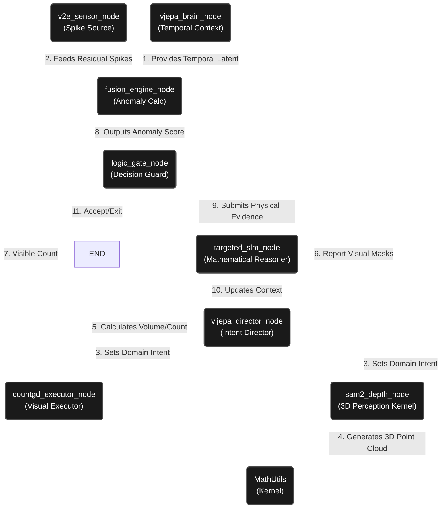

"""
Architecture Diagram

CFG Structure:
═══════════════════════════════════════════════════════════════════════════════
Start Symbol : ArchitectureDiagram (this document)

Non-Terminals :
┌─ INTERNAL ────────────────────────────────────────────────────────────────┐
│ <SensoryLayer> → v2e integration │
│ <BrainLayer> → V-JEPA integration │
│ <LogicLayer> → VL-JEPA integration │
│ <ActionLayer> → CountGD integration │
└───────────────────────────────────────────────────────────────────────────┘

Terminals : Mermaid, subgraph, graph

Production Rules:
ArchitectureDiagram → <SensoryLayer> <BrainLayer> <LogicLayer> <ActionLayer>
═══════════════════════════════════════════════════════════════════════════════
"""

# Architecture Diagram: Recursive Intent Category Theory

The following diagram represents the system as a Category where **Objects** are system states/components and **Morphisms** are the functional transformations between them.

