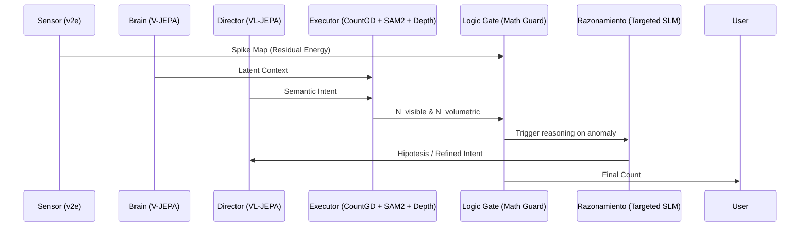

"""
Data Flow Diagram

CFG Structure:
═══════════════════════════════════════════════════════════════════════════════
Start Symbol : DataFlowDiagram (this document)

Non-Terminals :
┌─ INTERNAL ────────────────────────────────────────────────────────────────┐
│ <Sequence> → Data flow between modules │
└───────────────────────────────────────────────────────────────────────────┘

Terminals : Mermaid, sequenceDiagram, participant

Production Rules:
DataFlowDiagram → <Sequence>
═══════════════════════════════════════════════════════════════════════════════
"""

# Data Flow Diagram: Spike-to-Count Transformation

This diagram details the transformation of raw event data into actionable inventory intelligence.

