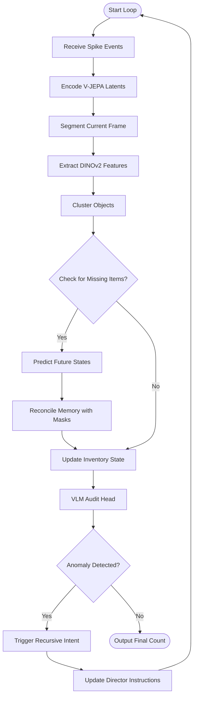

"""
Flow Chart

CFG Structure:
═══════════════════════════════════════════════════════════════════════════════
Start Symbol : FlowChart (this document)

Non-Terminals :
┌─ INTERNAL ────────────────────────────────────────────────────────────────┐
│ <InferenceLoop> → Real-time vision pipeline │
└───────────────────────────────────────────────────────────────────────────┘

Terminals : Mermaid, flowchart, graph

Production Rules:
FlowChart → <InferenceLoop>
═══════════════════════════════════════════════════════════════════════════════
"""

# Flow Chart: Inference & Occlusion Reasoning

Logic flow for the real-time vision pipeline.

