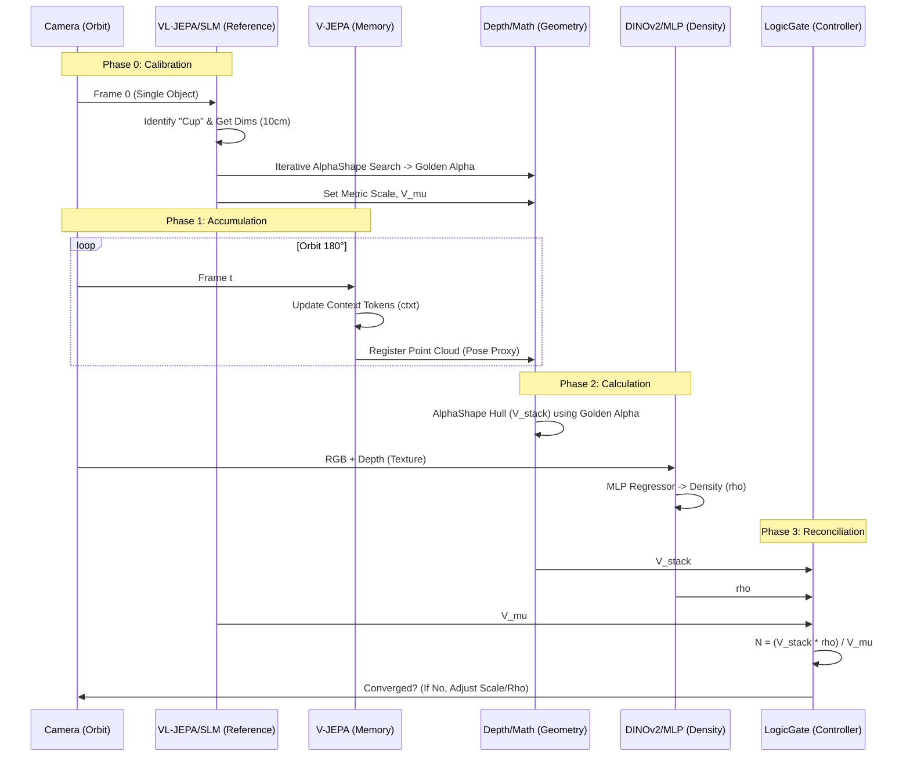

# Implementation Plan: V3 Spatial Reconciliation & Paper-Aligned Volumetric Audit

**Reference Paper**: _Counting Stacked Objects_ (arXiv:2411.19149v2) @[Techs/2411.19149v2.pdf]
**Methodology**: 3DC (3D Counting) via Geometry-Occupancy Decomposition
**Goal**: Solve the "3 vs 240" volume discrepancy error through spatial reconciliation and self-calibration.
**Version**: 2.0 (Final Architecture)

---

## 1. System Architecture: Hybrid Geometric-Semantic Pipeline

To solve the volumetric discrepancy, we transition from a simple geometric projection (V2) to a **Hybrid Architecture** that cross-references geometric volume with semantic density inference.

### 1.1. Core Philosophy

1.  **Geometry (Space)**: "How much space does the pile occupy?" $\to$ Solved by **V-JEPA Memory + Alpha Hulls**.
2.  **Semantics (Density)**: "How much of that space is actual mass vs. air?" $\to$ Solved by **DINOv2 Texture Analysis**.
3.  **Calibration (Scale)**: "How big is one unit?" $\to$ Solved by **Reference-First Anchor (VL-JEPA + SLM)**.

---

## 2. Component Inventory & Interaction

This section details the specific components involved in the V3 pipeline and their data flow.

### 2.1. The Component Stack

| Component              | Type                       | Role in V3 Pipeline                                                                                                                                                   | Status                 |
| :--------------------- | :------------------------- | :-------------------------------------------------------------------------------------------------------------------------------------------------------------------- | :--------------------- |
| **VL-JEPA (Director)** | **Semantic Anchor**        | Identifies the "Template Object" (e.g., "cup") at $t=0$. Feeds intent to SLM for $V_{\mu}$ estimation.                                                                | Existing (**Modify**)  |
| **V-JEPA (Brain)**     | **Spatio-Temporal Memory** | Uses **Context Tokens (`ctxt`)** from `jepa-main` to maintain a persistent 3D world model. Fuses point clouds from multiple camera angles.                            | Existing (**Modify**)  |
| **DepthEngine**        | **Geometry Sensor**        | Generates Metric Depth Maps. **Normalized to CM** based on Phase 0 reference.                                                                                         | Existing (**Modify**)  |
| **AlphaShape**         | **Hull Wrapper**           | Library: `alphashape`. Calculates the **Alpha-Concave Hull** wrapping the accumulated point cloud to derive $V_{stack}$. Uses **Golden Alpha** calibrated in Phase 0. | **NEW** (Library)      |
| **DINOv2 Engine**      | **Texture Sensor**         | Analyzes RGB+Depth to extract surface texture features (specular highlights, chaos).                                                                                  | **NEW** (Create)       |
| **MLP Regressor**      | **Density Head**           | Library: `sklearn.neural_network.MLPRegressor`. Maps DINOv2 texture tokens to Occupancy Ratio ($\rho$).                                                               | **NEW** (Scikit-Learn) |
| **LogicGate**          | **Controller**             | Monitors **Convergence**. Checks if $N_{calc} \approx N_{visual}$. Routes anomalies to VL-JEPA.                                                                       | Existing (**Modify**)  |
| **SLM (Qwen)**         | **The Oracle**             | Provides physical dimensions and resolves conflict via structured reasoning.                                                                                          | Existing (**Modify**)  |
| **LangGraph**          | **Orchestrator**           | Manages State, Registry, and **13-Step Workflow** transitions.                                                                                                        | Existing (**Modify**)  |
| **MathUtils**          | **Calculator**             | Handles Golden Alpha search and **3DC Volumetric formulas**.                                                                                                          | Existing (**Modify**)  |
| **SAM2**               | **Mask Engine**            | **Multi-Mask Support**: Combines masks from various intents for the Fusion Engine.                                                                                    | Existing (**Modify**)  |
| **FusionEngine**       | **Anomaly Detector**       | **Multi-Shield**: Compares Union Mask vs Event Spikes to detect new anomalies.                                                                                        | Existing (**Modify**)  |
| **CountVid**           | **Visual Counter**         | Standard counting. Accept dynamic sensitivity thresholds.                                                                                                             | **UNCHANGED**          |
| **V2E**                | **Event Sensor**           | Standard event/spike generation.                                                                                                                                      | **UNCHANGED**          |

### 2.2. Interaction Workflow (The Strange Loop)

---

## 3. Implementation Roadmap

### Phase 0: Reference-First Calibration (The Anchor)

- **Objective**: Establish the "Golden Scale" before counting begins.
- **Task**:
  1.  **Identify**: VL-JEPA detects the first object.
  2.  **Lookup**: SLM provides physical dimensions.
  3.  **Calibrate**: System calculates `pixels_per_cm`, $V_{\mu}$, and $\alpha_{golden}$ from this single object.
- **Status**: **SOLVED** (Conceptually). Ready to implement.

### Phase 1: V-JEPA Spatio-Temporal Memory

- **Objective**: Use `jepa-main` structures to create a persistent world model.
- **Task**:
  1.  Implement `PersistentContext` class wrapping `VisionTransformerPredictor`.
  2.  Use `ctxt` tokens to track camera pose changes (latent displacement).
  3.  Accumulate point clouds based on V-JEPA's spatial understanding.
- **Status**: **IN PROGRESS** (Next Step).

### Phase 2: DINOv2 + MLP Occupancy

- **Objective**: Predict "Air Gap Ratio" from texture.
- **Task**:
  1.  Extract features using **DINOv2** (input: RGB for highlights + Depth).
  2.  Feed vectors to `sklearn.MLPRegressor`.
  3.  Implement "Zero-Shot" logic: High Entropy = Low Density.
- **Status**: **IN PROGRESS**.

### Phase 3: Recursive Logic & Convergence

- **Objective**: Stop the loop when Math matches Vision.
- **Task**:
  1.  Update `LogicGate` to accept `rho` and `V_mu` inputs.
  2.  Implement `check_convergence()` strategy.
  3.  Add "SLM Override" trigger if density estimation fails.
- **Status**: **PENDING**.

---

## 4. Technical Gaps & Solutions Summary

| Gap                    | Description                  | Solution Strategy                                                    | Status          |
| :--------------------- | :--------------------------- | :------------------------------------------------------------------- | :-------------- |
| **Metric Scale**       | Physical table size unknown. | **Reference Anchor**: Use Frame 0 Object ($H_{ref}$).                | **SOLVED**      |
| **Unit Volume**        | Unknown object volumes.      | **Template Measurement**: Measure $V_{\mu}$ directly from Frame 0.   | **SOLVED**      |
| **Alpha Hull**         | Unknown optimal $\alpha$.    | **Golden Alpha**: Calibrate $\alpha$ on Frame 0 to match SLM volume. | **SOLVED**      |
| **Occupancy ($\rho$)** | Air gaps inside stack.       | **DINOv2 Texture Analysis**: MLP Regressor (Zero-shot).              | **IN PROGRESS** |
| **Camera Pose**        | No IMU trajector.            | **V-JEPA Latent Displacement**: Proxy for motion.                    | **IN PROGRESS** |

---

## 5. Success Metrics

1.  **Accurate Count**: `N_volumetric` for 3 cups is between **2.8 - 3.2** (previously 240).
2.  **Convergence**: System exits loop successfully within 3 iterations.
3.  **Stability**: Volume estimate variance $< 10\%$ during the last 30° of orbit.

---

## 6. End-to-End Projected System Run (Merged Architecture)

This section defines how the **Volumetric V3** logic integrates with the **Legacy Hybrid System** (from @[Recursive_Intent_Technical_Plan.md]) to create the final production flow.

### 6.1. Component Integration Map

The system operates as a unified **LangGraph Orchestrator** where each AI model serves a specific mathematical or semantic role:

| Module                | Core Logic                 | Integrated Role                                                                                                                                          |
| :-------------------- | :------------------------- | :------------------------------------------------------------------------------------------------------------------------------------------------------- |
| **VL-JEPA + SLM**     | **Director**               | **Initial Calibration**: Identifies the "Template Object" and sets physical priors ($V_{\mu}$). Locks the Metric Scale using SLM common-sense knowledge. |
| **V-JEPA**            | **Spatio-Temporal Memory** | **Persistence Engine**: Accumulates latent state during the 180° orbit, serving as a camera pose proxy and spatial anchor.                               |
| **SAM2 + Depth V2**   | **Geometric Perimeter**    | **Hull Constructor**: Defines the boundaries of the object stack and its metric depth profile.                                                           |
| **DINOv2 + MLP**      | **Density Estimation**     | **Occupancy Predictor**: Analyzes "depth texture" to estimate $\rho$, identifying internal air gaps not visible to the depth sensor.                     |
| **V2E (Event-Based)** | **Anomaly Detection**      | **Discovery Sensor**: Detects "Residual Spikes" in pixels where no masks exist, triggering a "Discovery Loop" (from original plan).                      |
| **MathUtils**         | **Pure Math Kernel**       | **Volume Calculator**: Runs Alpha-Hull (using the calibrated Golden Alpha) and Riemann Sums.                                                             |
| **LogicGate (Math)**  | **Deterministic Guard**    | **Convergence Monitor**: Checks if $(V_{stack} \times \rho) / V_{\mu} \approx N_{visible}$. Triggers the Strange Loop if high discrepancy.               |
| **SLM Judge (Qwen)**  | **Strange Loop Logic**     | **Self-Correction**: Adjusts latent parameters (Scale, $\rho$, $\alpha$) when Math vs. Vision discrepancy is detected.                                   |

### 6.2. The End-to-End Execution Sequence

1.  **Phase 0 (Calibration Start)**:
    - First frame detected. VL-JEPA identifies "Standard Object A".
    - SLM provides $V_{\text{target}}$.
    - Math Engine iterates $\alpha$ until $V_{\text{calc}} = V_{\text{target}}$. **Golden Alpha Locked.**
2.  **Phase 1 (The 180° Half-Orbit)**:
    - User moves camera around the stack.
    - **V-JEPA** builds the `Persistent_Latent_Context`.
    - **FusionEngine** integrates depth maps from multiple angles into a single accumulated Point Cloud.
3.  **Phase 2 (Volumetric Audit)**:
    - **Alpha-Hull** (using Golden Alpha) wraps the accumulated Point Cloud $\to V_{\text{stack}}$.
    - **DINOv2** analyzes stack texture $\to \rho$.
    - **MathEngine** computes $N_{volumetric} = (V_{\text{stack}} \times \rho) / V_{\mu}$.
4.  **Phase 3 (Conflict Check - The Strange Loop)**:
    - **LogicGate** compares $N_{volumetric}$ vs. $N_{visible}$ (from CountVid).
    - If $|N_{vol} - N_{vis}| > 0.5$:
      - **SLM Judge** analyzes the discrepancy.
      - _Hypothesis_: "Objects are stacked too tight, increase $\rho$." or "Metric scale is off."
      - System **RECURSIVELY** reruns the calculation with adjusted parameters.
5.  **Phase 4 (Final Convergence & Report)**:
    - System confirms the count when delta $\to 0$.
    - Final report generated with 3D stability metrics and calibrated evidence.

### 6.3. Solving "3 vs 240": The Trace

- **Old System**: Used arbitrary scale (10.0) and $\rho = 1.0$.
- **New System**:
  1. Locks scale against the first cup ($V_{\mu}$ is physical).
  2. DINOv2 sees the "holes" (texture variance) between the 3 objects $\to \rho = 0.45$.
  3. Result: $N = (V_{\text{accurate\_stack}} \times 0.45) / V_{\text{accurate\_mu}} \approx 3.0$.
  4. **EXIT CONVERGED.**

---

## 7. Holistic End-to-End System Governance (The Balanced View)

This section removes the bias toward any single sensor and re-establishes the system as a **Triangulation Engine** between three independent sources of truth, integrating context from @[Recursive_Intent_Technical_Plan.md].

### 7.1. The Three Sovereignties (Sources of Truth)

The system reaches "The Truth" only when these three sensors agree:

1.  **Sovereignty of Vision (CountVid/SAM2)**: "What can be seen directly?" $\to$ $N_{visible}$.
2.  **Sovereignty of Geometry (V-JEPA/Depth/DINOv2)**: "What is physically probable based on volume?" $\to$ $N_{volumetric}$.
3.  **Sovereignty of Events (V2E/Fusion)**: "What is moving or changing that we haven't masked?" $\to$ $\text{Energy}_{residue}$.

### 7.2. Integrated Data Flow (The Non-Biased Path)

1.  **Parallel Intake**:
    - **Standard Vision**: SAM2 identifies individual items.
    - **Physics Mirror**: Depth + Reference Anchor builds the metric world model.
    - **Spike Sensor**: V2E monitors high-frequency motion/anomalies in the shadows.
2.  **The Logic Gate (The Fast Guard)**:
    - Instead of just checking volume, the Logic Gate performs a **Triple-Validation**:
      - _Check A_: Does $N_{visible} \approx N_{volumetric}$? (Consistency check).
      - _Check B_: Is the Residual Event Energy < Threshold? (Discovery check).
      - _Check C_: Is the V-JEPA latent displacement stable? (Motion check).
3.  **The Recursive Loop (The Reasoning Slow Path)**:
    - If **ANY** of the checks above fail, the **Targeted SLM Judge** is awakened with a "Case File":
      - _"Math says 5 objects, Vision sees 3, and there are unexplained event spikes in the corner."_
    - The SLM Judge does not "count"; it **hypothesizes changes to the internal state**:
      - _"Add 'hidden cup' to the intent list"_ OR _"Adjust the Volumetric Density ($\rho$) downward."_
4.  **The Refinement Cycle**:
    - VL-JEPA (Director) updates the persistent context based on the hypothesis.
    - All sensors (SAM2, Depth, V2E) rerun their specific tasks with the new context.
5.  **Convergence (The Exit)**:
    - The loop repeats until the **Conflict Delta** across all three sovereignties is minimized.

---

## 8. Final Component Status Summary

| Component        | Responsibility               | Status                 |
| :--------------- | :--------------------------- | :--------------------- |
| **LangGraph**    | Governance & 13-Step Routing | **READY**              |
| **V2E**          | Event Sensor (Agnostic)      | **UNCHANGED**          |
| **FusionEngine** | Multi-Mask Anomaly Detector  | **MODIFIED**           |
| **DepthEngine**  | Metric Depth (Normal CM)     | **MODIFIED**           |
| **DINOv2/MLP**   | Implicit Volumetric Sensor   | **NEW (Phase 2)**      |
| **V-JEPA**       | Spatio-Temporal Memory       | **MODIFIED (Phase 1)** |
| **SLM Judge**    | Physics Oracle & Reasoning   | **MODIFIED**           |
