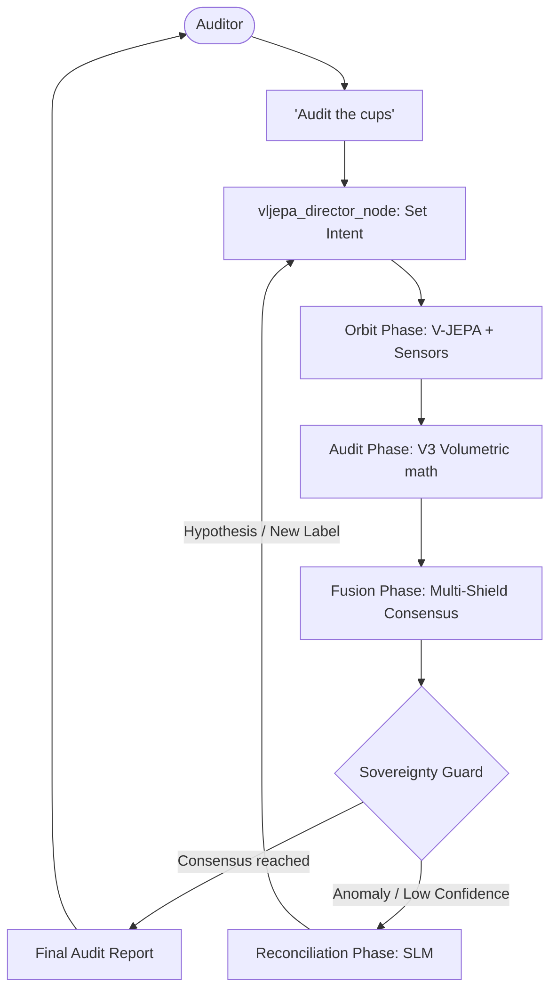

# User Flow: Sovereignty Audit Assistant

The end-user (Auditor) interacts with the system through a high-level natural language interface, with the "Sovereignty" protocol handling physical verification automatically.

```mermaid
graph TD
    User([Auditor]) --> Prompt["'Audit the cups'"]
    Prompt --> Director[vljepa_director_node: Set Intent]
    Director --> Vision[Orbit Phase: V-JEPA + Sensors]
    Vision --> Math[Audit Phase: V3 Volumetric math]
    Math --> Fusion[Fusion Phase: Multi-Shield Consensus]
    Fusion --> Gate{Sovereignty Guard}

    Gate -- "Consensus reached" --> Resolved[Final Audit Report]
    Gate -- "Anomaly / Low Confidence" --> Reasoner[Reconciliation Phase: SLM]

    Reasoner -- "Hypothesis / New Label" --> Director
    Resolved --> User
```

## 1. System Sovereignty

- **Volumetric Ground Truth**: The system prioritizes physical evidence (AlphaHull volume) over simple visual counting.
- **Self-Correction**: If the auditor clarifies an intent (e.g., "The cups are stacked in groups of 3"), the system auto-calibrates $V_{\mu}$ to match the physical reality.

## 2. Modes of Interaction

- **Passive Monitoring**: Continuous Sovereignty checks during inventory shifts.
- **Active Querying**: User asks "Where is the discrepancy?" and the system highlights the shield (Spatial/Volumetric/Latent) that failed the consensus.
