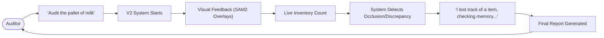

# User Flow: Inventory Audit Assistant

The end-user (Auditor) interacts with the system through a high-level natural language interface.

## 1. Modes of Interaction

- **Passive Monitoring**: The system counts silently and flags anomalies.
- **Active Querying**: User asks "Where did the Red Bull box go?" and the system highlights the last known/predicted location.
